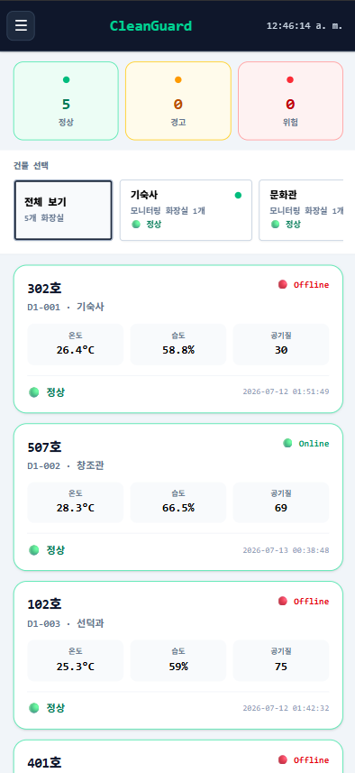
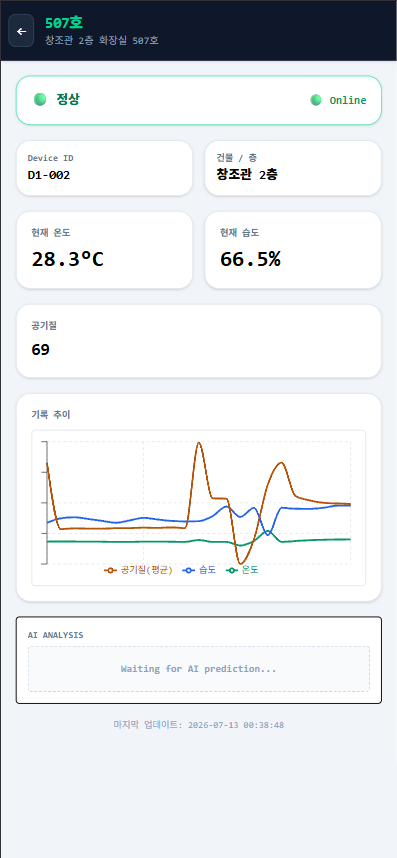
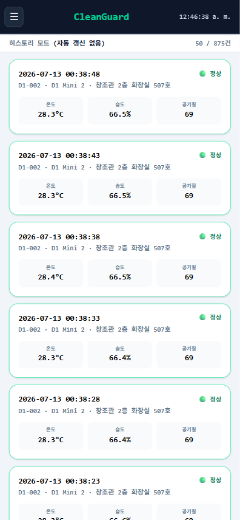
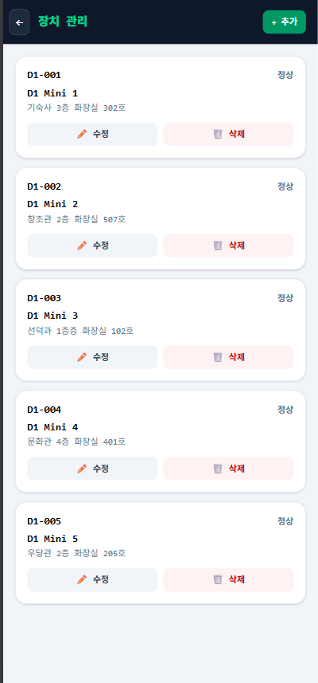
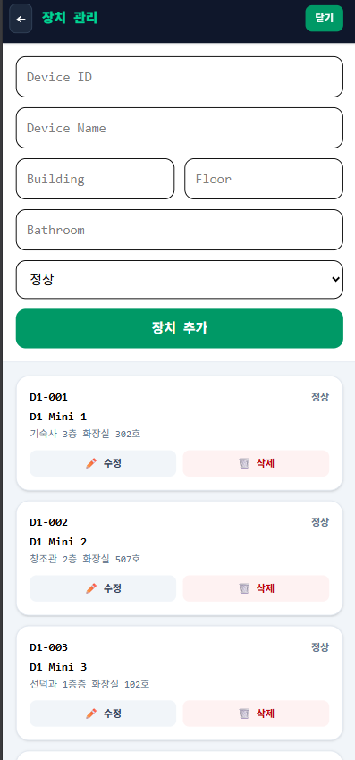

<div align="center">

# CleanGuard

**Real-time restroom environmental monitoring — 실시간 화장실 환경 모니터링 시스템**

[](https://react.dev)
[](https://vitejs.dev)
[](https://tailwindcss.com)
[](https://www.php.net)
[](https://www.mysql.com)
[](LICENSE)

</div>

## Overview

CleanGuard is a Capstone Design project that monitors restroom
environmental conditions (temperature, humidity, air quality) across
multiple buildings in real time. ESP8266 sensor nodes report readings to
a PHP/MySQL backend, and a React dashboard visualizes device status,
historical trends, and (in a future phase) AI-based predictions —
letting facility staff spot a problem (freezing pipes, a leak, poor air
quality) before it becomes a complaint.

The same dashboard adapts to three layouts from one codebase: a desktop
view, a full-screen mobile app for portrait phones, and a tablet/
landscape dashboard — chosen automatically based on screen size and
orientation, with no separate builds.

## Features

- **Live & Test monitoring** — auto-refreshing grid of every registered restroom's latest reading, grouped by building.
- **History mode** — a paginated, non-auto-refreshing log of every individual sensor reading ever recorded, independent from the live view.
- **Historical trend charts** — per-device temperature/humidity/air-quality line chart, backed by 5-minute-bucketed averages.
- **Device Management (CRUD)** — register, edit, and remove sensor nodes, with building/floor/bathroom parsed from a single location string.
- **Responsive, orientation-aware UI** — a dedicated mobile app for portrait phones, a landscape/tablet dashboard, and the original desktop dashboard, all sharing the same components, hooks, and services.
- **AI status panel (in progress)** — a prepared UI slot for AI-based predictions (window open, faucet on, leak, freeze risk) written by a separate Raspberry Pi process; currently a placeholder pending the live demo's AI server.

## Technologies

**Frontend:** React 19, Vite 8, Tailwind CSS 4, React Router 7, Recharts
**Backend:** PHP 8, MySQLi, MySQL/MariaDB
**Hardware:** ESP8266, DHT22 (temperature/humidity), MQ-135 (air quality)
**AI (external):** Raspberry Pi prediction service, writing to a shared MySQL table

## Architecture

```
ESP8266 sensor nodes  --HTTP POST-->  backend/ (PHP)  <-->  MySQL
        |                                  ^
        | DHT22 + MQ-135 readings          | reads/writes
        v                                  |
   upload.php  ------------------------->  sensor_data / sensor_data_test / devices
                                                   ^
                                                   | GET (JSON)
                                                   |
                                          frontend/ (React dashboard)
                                                   |
                                                   v
                                          Facility administrator

Raspberry Pi AI process (separate) --> restroom_sencor_fake_data table --> getAIStatus.php
  (reads sensor_data independently;    (read-only from the frontend's perspective;
   the React app never runs the         not currently displayed live — see AIStatusCard)
   AI model itself)
```

Each layer has one job: the ESP8266 nodes only sense and report; PHP only
validates and moves data between HTTP and MySQL; MySQL is the single
source of truth; React only fetches and renders; the Raspberry Pi process
is entirely separate from and asynchronous to the React app.

## Folder Structure

```
CleanGuard/
├── frontend/          React + Vite dashboard (desktop, mobile, landscape/tablet)
│   ├── src/
│   │   ├── components/    Shared UI: cards, panels, header, charts, modals
│   │   ├── mobile/         Portrait-phone screens
│   │   ├── dashboard/      Landscape/tablet dashboard
│   │   ├── pages/           Desktop pages (Admin, Devices)
│   │   ├── hooks/            Data-fetching + layout-mode hooks
│   │   ├── services/          Centralized backend API client
│   │   └── utils/              Status rules, location parsing
│   ├── public/
│   └── .env.example
├── backend/            PHP REST API (one file per endpoint)
├── database/            Schema reference (see database/README.md)
├── esp8266/              Sensor node documentation
├── documentation/         Capstone report, presentation, source code reference
├── screenshots/            App screenshots
├── legacy/                  Superseded prototype code, kept for history
├── README.md
├── LICENSE
└── .gitignore
```

## Installation

Requires Node.js 18+ and a PHP 8 + MySQL environment for the backend.

```bash
git clone https://github.com/<your-org>/cleanguard-dashboard.git
cd cleanguard-dashboard/frontend
npm install
```

## Running locally

```bash
cd frontend
cp .env.example .env   # adjust VITE_API_URL if your backend isn't at the default
npm run dev
```

Other frontend scripts: `npm run build` (production build), `npm run
preview` (preview the build), `npm run lint` (ESLint).

## Backend setup

1. Serve the `backend/` folder with PHP 8 (Apache/Nginx + PHP-FPM, or any
   shared PHP host).
2. Copy `backend/config.local.example.php` to `backend/config.local.php`
   and fill in your real database credentials (this file is git-ignored
   and never committed) — or set `DB_HOST` / `DB_NAME` / `DB_USER` /
   `DB_PASSWORD` as environment variables instead.
3. See [`backend/README.md`](backend/README.md) for what each endpoint does.

## Database setup

No `.sql` dump is tracked in this repository. See
[`database/README.md`](database/README.md) for the table structure each
endpoint expects (`devices`, `sensor_data`, `sensor_data_test`,
`restroom_sencor_fake_data`), inferred directly from the backend's
queries.

## Screenshots

| Dashboard | Detail | History |
|---|---|---|
|  |  |  |

| Device Management | Add Device |
|---|---|
|  |  |

## Mobile Version

CleanGuard is one codebase, not a separate mobile app: `useLayoutMode()`
detects narrow-portrait phones, landscape phones/tablets, and desktop
browsers (using `matchMedia`, including pointer type to tell a touch
tablet apart from a resized desktop window), and `App.jsx` renders the
matching layout — a full-screen mobile app, a landscape/tablet dashboard,
or the original desktop dashboard — all built from the same components,
hooks, and API services.

## Future Work

- Wire the AI panel to the live prediction server for the demonstration.
- Automate the sync between `sensor_data` and the AI prediction table (currently a manual/separate process).
- Authentication for administrators.
- Push/email notifications when a restroom enters Warning or Danger status.
- Move the backend from HTTP to HTTPS.
- Move off shared hosting to a managed cloud environment.

## Contributors

- CleanGuard Capstone Design Team

## License

MIT — see [LICENSE](LICENSE).
